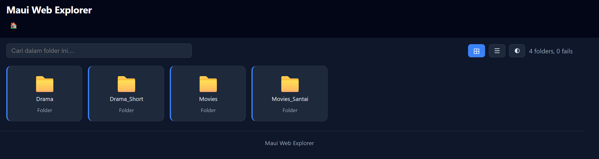
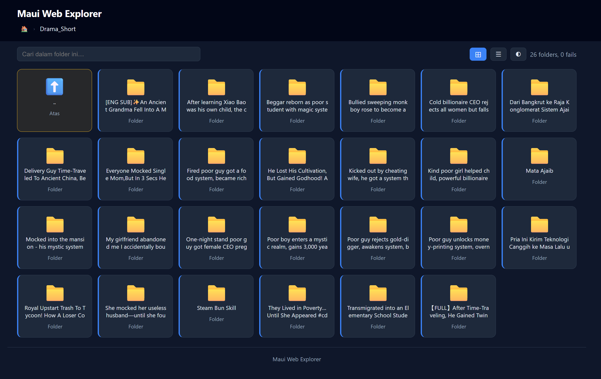

<div align="center">



# Maui Web Explorer

### A single-file PHP file explorer and media browser for the web

Browse, stream, and preview the files on your server from any browser.  
**Zero dependencies. Zero database. Zero build step.** Drop in one `index.php` and you are done.


[Features](#-features) &nbsp;|&nbsp; [Screenshots](#-screenshots) &nbsp;|&nbsp; [Requirements](#-requirements) &nbsp;|&nbsp; [Install](#-installation) &nbsp;|&nbsp; [Security](#-security-guide-for-public-use) &nbsp;|&nbsp; [FAQ](#-faq)

</div>

---

## What is it?

**Maui Web Explorer** is a tiny, self-hosted **PHP file manager** and **directory browser** that turns any folder on your web server into a clean, browsable, streamable file index. It is one PHP file, a few hundred lines, no Composer packages, no JavaScript frameworks, no database to set up, and no build tooling to learn.

It is built for people who already have a web server (Apache, Nginx, LiteSpeed, IIS, Caddy, or the PHP built-in server) and just want a fast way to share, browse, and play back files from a folder: media libraries, project archives, course materials, homelab storage, photo and video collections, or anything else you keep on disk.

If you searched for any of these, you are in the right place:

- **PHP file explorer** or **PHP file manager** (single file, no dependencies)
- **self-hosted file browser** for Apache / Nginx
- **directory listing** script with media preview
- **PHP media server** with video / audio streaming and resume
- **minimal file index** for a homelab or personal NAS

---

## Why Maui Web Explorer?

There are many file browsers. Most want a database, a package manager, a container, or a frontend build. This one does not.

- **One file.** The whole app is `index.php`. Read it, audit it, ship it. Nothing to install.
- **Symlink friendly.** Symlinks inside your base folder are followed by the operating system to wherever they point, even outside the base directory. Mount other disks or shared folders as symlinks and they just work.
- **Streams big files with resume.** Large videos and archives are served with HTTP Range support (206 Partial Content), so players can seek and downloads can resume. Files are never loaded fully into memory.
- **Inline preview.** Images, video, audio, PDF, and text open in a lightbox without leaving the page.
- **Handles big folders.** Server-side pagination caps the page size, so a folder with thousands of entries stays fast.
- **Dark and light themes.** Persisted in the browser, follows the system preference on first load.
- **Search and sort.** Server-side search across the whole folder, and click-to-sort by name, size, or modified date.
- **No bloat.** No tracker, no analytics, no phone-home. Your files stay on your server.

---

## Features

**Browsing**
- Folder tree with breadcrumbs and an up / parent shortcut
- Grid view and list view, switchable and remembered
- Folders grouped first, sorted alphabetically by default
- File-type icons for dozens of common extensions
- Hidden entries: `.htaccess`, `.htpasswd`, `.git`, `.gitignore`, `.env`, and the script itself are never shown

**Playback and download**
- HTTP Range / resume streaming for large files (206 Partial Content, 416 on bad ranges)
- Inline lightbox preview for images, video, audio, PDF, and text/code
- Correct Content-Type per extension, with safe Content-Disposition (inline for media, attachment for everything else)
- `X-Content-Type-Options: nosniff` on every download

**Scale and usability**
- Server-side search (case-insensitive) across all items, applied before pagination
- Server-side pagination (default 200 entries per page)
- Click-to-sort columns: name, size, modified date
- Dark / light theme toggle, saved in `localStorage`
- Read-failure counter shown in the toolbar ("N fails")

**Security model**
- Lexical path normalization rejects `..` traversal on both `/` and `\` (closes the Windows backslash hole)
- Symlinks are deliberately followed, so you control exposure by choosing which symlinks to place
- No PHP login layer: protect the entry at the web-server level (see the [security guide](#-security-guide-for-public-use))

---

## Screenshots

### Grid view, root folder (dark theme)


The root directory rendered as a card grid. The toolbar carries the folder search box, the grid / list view switch, and the dark / light theme toggle. The status line reports the live folder and file counts.

### Grid view, browsing a subfolder (dark theme)



Inside a subfolder. The breadcrumb shows the current path, the first card is the parent ("up") shortcut, and the grid lays out the folder contents. The same toolbar (search, view toggle, theme toggle) stays in place.

---

## Requirements

| Requirement | Detail |
|---|---|
| **PHP** | 7.4 or newer (uses arrow functions). PHP 8.x fully supported. |
| **Web server** | Any server that can run PHP: Apache, Nginx + PHP-FPM, LiteSpeed, IIS, Caddy, Lighttpd, or `php -S`. |
| **Database** | None. |
| **Composer** | Not required. |
| **Extensions** | PHP core only. `fileinfo` is used if available for better MIME types, with a built-in fallback map. `mbstring` is **not** required. |
| **Permissions** | The folder you want to browse must be readable by the web-server / PHP user. |

> The screenshots above were taken on Windows, but Maui Web Explorer runs anywhere PHP runs: Linux, macOS, BSD, and Windows.

---

## Installation

Pick the web server you already have. In every case the only step is to place `index.php` in the folder you want to share and open it in a browser.

### Option A: PHP built-in server (fastest, great for trying it)

No web server install needed at all. From the folder you want to share:

```bash
php -S localhost:8000
```

Then open `http://localhost:8000/` in your browser. The built-in server is fine for personal and LAN use; for anything exposed to the internet, use Apache or Nginx behind HTTPS.

### Option B: Apache

Apache runs `index.php` automatically when it is the directory index.

1. Put `index.php` in the folder to share, for example `/var/www/files/index.php`.
2. Make sure PHP is enabled for Apache (`libapache2-mod-php` on Debian/Ubuntu, or the PHP module on Windows/XAMPP).
3. Confirm `DirectoryIndex` includes `index.php` (it usually does by default).
4. Visit the folder URL, for example `https://example.com/files/`.

A minimal VirtualHost snippet:

```apache
<VirtualHost *:80>
    ServerName files.example.com
    DocumentRoot /var/www/files

    <Directory /var/www/files>
        DirectoryIndex index.php
        AllowOverride All
        Require all granted
    </Directory>
</VirtualHost>
```

### Option C: Nginx (with PHP-FPM)

Nginx does not run PHP itself, so you point `.php` requests at PHP-FPM.

1. Put `index.php` in the folder to share, for example `/var/www/files/index.php`.
2. Install and run PHP-FPM (`php-fpm` / `php8.x-fpm`).
3. Use a server block like this:

```nginx
server {
    listen 80;
    server_name files.example.com;
    root /var/www/files;
    index index.php;

    location / {
        try_files $uri $uri/ /index.php?$query_string;
    }

    location ~ \.php$ {
        include fastcgi_params;
        fastcgi_pass   unix:/run/php/php-fpm.sock;   # or 127.0.0.1:9000
        fastcgi_param  SCRIPT_FILENAME $document_root$fastcgi_script_name;
        fastcgi_read_timeout 600s;                    # generous, for big-file streaming
    }
}
```

> Note: large files stream in chunks, so a generous `fastcgi_read_timeout` and `proxy_read_timeout` avoid timeouts on slow links.

### Option D: LiteSpeed / OpenLiteSpeed

LiteSpeed runs PHP through LSAPI. Place `index.php` in the document root and ensure the vhost has PHP enabled (External App + Script Handler for `php`). No extra config is needed beyond standard PHP hosting.

### Option E: IIS (Windows)

Install PHP for IIS via the Web Platform Installer or PHP Manager, enable the PHP handler for the site, drop `index.php` into the site root, and add `index.php` to the Default Documents list.

### Option F: Caddy

With Caddy + PHP-FPM (FrankenPHP also works):

```caddy
files.example.com {
    root * /var/www/files
    php_fastcgi unix//run/php/php-fpm.sock
    file_server
}
```

### Option G: Lighttpd

Enable `mod_fastcgi` + `mod_cgi`, configure PHP as a FastCGI backend, set `index-file.names += ( "index.php" )`, and place `index.php` in the document root.

---

## Configuration

All settings live in the clearly marked `// === Config ===` block at the top of `index.php`. Edit the file directly.

```php
$SITE_NAME = 'Maui Web Explorer';   // shown in the header and footer
$BASE_DIR  = __DIR__;               // the folder to browse (defaults to the script's folder)
$HIDDEN    = ['.htaccess','.htpasswd','.git','.gitignore','.env','index.php'];
$PER_PAGE  = 200;                   // entries per page (0 = pagination disabled)
```

- **`$BASE_DIR`**: point this at any folder on the server to browse it without moving the script.
- **`$HIDDEN`**: anything you want kept out of the listing.
- **`$PER_PAGE`**: lower it for very large folders, set `0` to disable pagination.
- **`$ICONS`** and **`$PREVIEW`**: customize file-type icons and which extensions open in the lightbox.

---

## Security guide (for public use)

If you expose Maui Web Explorer to the internet, **protect the entry point at the web-server layer** and **serve it over HTTPS**.

### 1. Password-protect it (Apache + Basic Auth)

A ready-to-use example is included as [`htaccess.example`](htaccess.example). Quick version:

```bash
# create a user:password file (keep it OUTSIDE the web root if you can)
htpasswd -c /etc/apache2/.htpasswd youruser

# then in the folder, a .htaccess like:
AuthType Basic
AuthName "Restricted"
AuthUserFile /etc/apache2/.htpasswd
Require valid-user
```

> The repo's `.gitignore` excludes real `.htaccess` and `.htpasswd` files so your password hash is never committed.

### 2. Use HTTPS

Basic Auth over plain HTTP sends credentials in cleartext. Always serve over HTTPS and consider enabling HSTS at the web-server level.

### 3. Understand the symlink model

This is intentional and important. Maui Web Explorer normalizes the requested path lexically and rejects any `..` segment that would escape `$BASE_DIR`, on both `/` and `\`. It does **not** call `realpath()`. That means:

- Path traversal (`?p=../../../etc/...` or the Windows backslash form) is blocked.
- A **symlink** you place inside `$BASE_DIR` is resolved by the operating system to its real target, **even if that target is outside `$BASE_DIR`**.

So exposure is controlled by **which symlinks you choose to create**. A symlink is treated exactly like a normal folder or file: it can be browsed, streamed, and previewed. Only place symlinks that point at content you intend to share.

### 4. Run the folder read-only

Mount or permission the shared folder as read-only for the web-server user. Maui Web Explorer never writes, deletes, or uploads, but read-only permissions are still the safest baseline.

---

## How symlink support works

```php
function resolve_safe(string $rel, string $base): ?string {
    $rel = trim(str_replace('\\', '/', $rel), '/');   // close the Windows backslash hole
    $parts = [];
    foreach (explode('/', $rel) as $seg) {
        if ($seg === '' || $seg === '.') continue;
        if ($seg === '..') return null;               // block escape from base
        $parts[] = $seg;
    }
    return $parts ? ($base . '/' . implode('/', $parts)) : $base;
}
```

The function builds the path from clean segments and returns `null` on any traversal attempt, but never collapses symlinks away. The operating system then resolves the symlink at access time. That single choice is what makes symlink support possible while still blocking directory traversal.

---

## FAQ

**Do I need Composer or a database?**
No. One PHP file, core PHP only.

**Does it work on Windows?**
Yes. Path normalization handles both `/` and `\`, and the screenshots were taken on Windows.

**Can it stream very large files (tens of GB)?**
Yes. Files are read in 8 KB chunks with HTTP Range support, so memory use stays flat and players can seek / resume. Give your web server a generous read timeout for slow clients.

**Will it show my `.env` or `.htpasswd`?**
No. Sensitive dotfiles are in `$HIDDEN` by default, and the real `.htaccess` / `.htpasswd` are gitignored.

**Is there a login system?**
Not in PHP, by design. Protect the entry at the web-server layer (Basic Auth, IP allow-list, mTLS, or a reverse proxy with auth). See the [security guide](#-security-guide-for-public-use).

**Can I change the colors, name, or icons?**
Yes. The theme lives in CSS variables at the top of the file, the site name is `$SITE_NAME`, and icons are in the `$ICONS` map.

**Is it safe to put on the public internet?**
Yes, when you follow the security guide: password-protect at the web-server layer, use HTTPS, and only symlink content you mean to share.

---

## Browser support

Any modern browser (Chrome, Edge, Firefox, Safari). Inline preview relies on the browser's native `<video>`, `<audio>`, ``, and PDF support, so what plays depends on the formats the browser supports.

---

## Contributing

Issues and pull requests are welcome at [github.com/azmawee/maui-web-explorer](https://github.com/azmawee/maui-web-explorer). Keep it single-file and dependency-free: that constraint is the point of the project.

---

## Author

**Azmawee** - ex-BNM, ex-CIMB, hidup bebas berjejak bumi.

- GitHub: [@azmawee](https://github.com/azmawee)

If Maui Web Explorer saved you a container or a database, consider giving it a star so others find it too.

---

## License

Released under the **MIT License** - see [LICENSE](LICENSE). Free for personal and commercial use.

---

<sub>Keywords: PHP file explorer, PHP file manager, single-file PHP file browser, self-hosted file browser, directory listing script, PHP media server, file index, homelab file browser, Apache file manager, Nginx file browser, symlink friendly PHP, HTTP Range streaming PHP.</sub>
